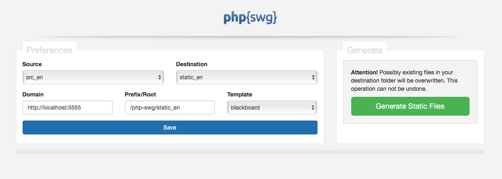

# PHP Static Website Generator


## Install

Download the latest release, unzipp and upload the contents to your (not public) webserver. For example in a directory named <code>/php-swg/</code>. There is no installation script you need to execute - everything is ready for use. Simply adjust the read/write permissions of the Destination directory (default folder is <code>/static_en/</code>) (CHMOD 0777 - apply to enclosed files)

That's it. Just navigate in your webbrowser to the <code>/php-swg/app/</code> directory.<br>
Example: <code>http://localhost:8888/php-swg/app/</code>.

__Note:__ It's not recommended, to run php{swg} on a public server. If you want to do it anyway, you should protect the directory <code>/app/</code> via .htaccess/.htpasswd. Recommended: Publish only the static (<code>/static_en/</code>) directory.


__Here are some Tips and Tricks for successfully using php{swg}.__



* __Source:__ Select the folder that contains the markdown files and folder structure you want to convert in a static website.
* __Destination:__ After processing, all files are stored in this folder.
* __Prefix/Root:__ This string is used for the navigation in your static website. Each Link in the navigation will be prefixed with this string.
* __Template:__ Select the Template which is used for styling the static website.

### Create new source- and destination-folders

__Source-folder:__ Create a new folder and name it soemthing like <code>src_*</code>. All folders whose name starts with <code>src_</code> will appear in the selection list for Sources.

__Destination-folder:__ Create a new folder and name it something like <code>static_*</code>. All folders whose name starts with <code>static_</code> will appear in the selection list for Destinations (remember: destination folders must have recusrive read and write permissions).

### Add new Contents to your static Website

The easiest way is to apply a markdown (<code>index.md</code>) document within the source folder. This file will be converted to the homepage of your site. You can add as many files as you like. The Generator will build the Navigation and Pages automatically.

#### Sort and Structure

If you won‘t get a alphabetic structure, simple prefix your source files with numbers and seperate the file names with two hyphens. Example: <code>100--credits.md</code>. The sorting part in the filename (100--) won‘t show up in the generated static site - the file will be converted to <code>credits.html</code>. Of course you can also create subfolders. The rules for sorting subfolders are the same.

__Note:__ If you create a subfolder in your source files, it must contain an index.md file.

#### The Markdown files (.md)

The source files are splitted in two sections. The header-informations (at the top, bordered by three dashes) and the mardown code which will be generated into HTML.

#### Add images and files to your Project

Create a directory <code>/_assets/</code> within your Source folder. This folder (with all it's contents) will be copied in your generated static website's root. Use this directory for your Images or Files (e.g. Downloads etc.)

Example usage in your markdown files: `````` or in a subfolder: ``````

More information and examples about Markdown Syntax can be found on

* https://en.wikipedia.org/wiki/Markdown
* and http://daringfireball.net/projects/markdown/

### Templates and variables

All templates are located in the <code>/theme/</code> folder.
php{swg} comes with two - ready to use - themes (silver and blackboard).

If you want to create an new theme, I would recommend to duplicate simply one of the default themes - silver or blackboard - and make the changes in this copy.

#### Template files

* tpl/index.tpl (required)
* tpl/footer.tpl
* tpl/header.tpl

__Note:__ The complete activated Template folder will be copied in the static website‘s root.


#### Available Variables

You can use the variables in both the template and in the Markdown files.

| Variable  | Replacement |
| ------------- | ------------- |
| {$title} | The title from your markdown document. |
| {$description} | The description from your markdown document. |
| {$keywords} | The keywords from your markdown document. |
| {$root} | The Root/Prefix from your Preferences. |
| {$navigation} | Will be replaced with the Navigation. |
| {$content} | The content from your markdown document. |
| {$header} | Will be replaced with the contents from the file tpl/header.tpl |
| {$footer} | Will be replaced with the contents from the file tpl/footer.tpl |
| {$filename_orig} | Filename of the markdown file |
| {$filepath_orig} | Complete path to the markdown file |
| {$filemtime} | file modification time (Unix timestamp) |
| {$filemtime_Y} | file modification time - Year e.g. 2016 |
| {$filemtime_m} | file modification time - Month e.g. 02 |
| {$filemtime_d} | file modification time - Day e.g. 07 |
| {$filemtime_H} | file modification time - Hour e.g. 11 |
| {$filemtime_i} | file modification time - Minutes e.g. 45 |
| {$filemtime_s} | file modification time - Seconds e.g. 33 |

### Examples:

* https://flatcore.org/docs/en/
* https://flatcore.org/docs/de/


### Credits

* Parsedown - Converting Markdown to HTML - MIT License (MIT)<br>
http://parsedown.org
* Spyc - A Simple PHP YAML Class - MIT License (MIT)<br>
https://github.com/mustangostang/spyc/
* Bootstrap - HTML, CSS and JS framework<br>
http://getbootstrap.com/
