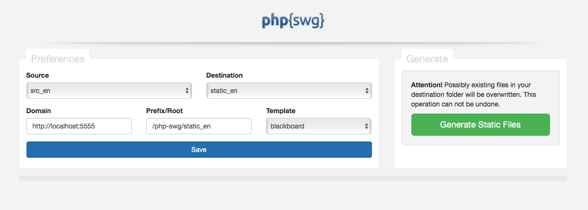

# Settings



<hr>

### Source

Select the folder that contains the markdown files and folder structure you want to convert in a static website.

### Destination

After processing, all files are stored in this folder.

### Domain

Your Domain Name. This is used for the sitemap.xml. All URLs in the sitemap file will be prefixed with this. Example:
```
// ...
<url>
	<loc>http://example.com/static_en/website.html</loc>
	<lastmod>2016-03-24T14:19:27+01:00</lastmod>
</url>
// ...
```

### Prefix/Root

This string is used for the navigation in your static website.<br>__Each Link in the navigation will be prefixed with this string.__

Example:

your input:  <code>`/static_en`</code> results in:
```
<a href="/static_en/website.html">Cool Website</a>
```

your input:  <code>`/subfolder/static_en`</code> results in:
```
<a href="/subfolder/static_en/website.html">Cool Website</a>
```

### Template

Select the Template which is used for styling the static website.
