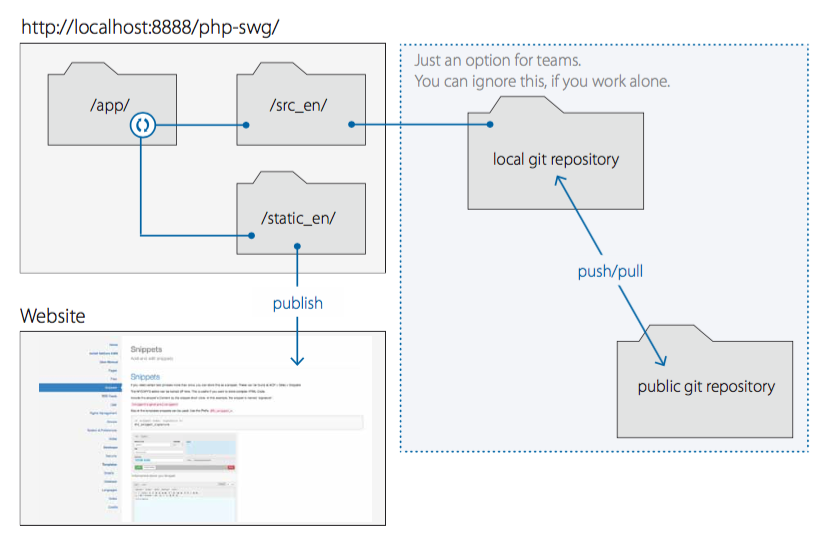

__Note__ It‘s not recommended, to run php{swg} on a public server. If you want to do this anyway, you should protect the ```/app/``` directory via .htaccess/.htpasswd. __Recommended:__ Publish only the static (for example ```/static_en/```) directory.

### A typical use case would look like this:



<hr>

## Resources

* The Themes are based on [Bootstrap](http://getbootstrap.com)
* All you need to know about Markdown, you will find here: [Markdown: Basics](https://daringfireball.net/projects/markdown/basics)